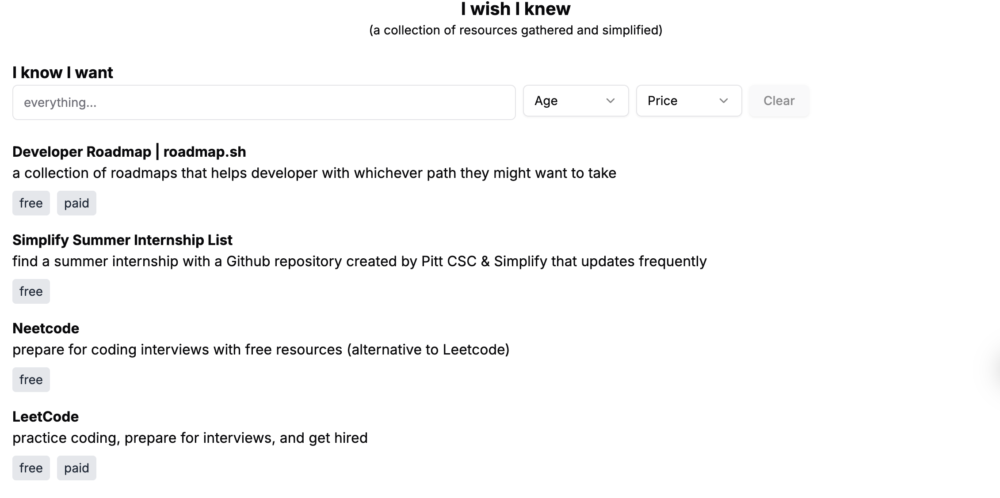

# I wish I knew
**(a collection of resources gathered simplified)**

# What is this?
this is a complete list that provides resources that **“I wish I knew”** that might be helpful for people that are starting to get into the computer science field.  
There are a handful of resources that I added on, I wish I knew before the deadline was actually up, even if it was up for some people, there might be someone out there that hasn't seen it but is able to do it.

## demo
check all the live resources here: [iwishiknew website](https://iwishiknew.vercel.app/)  


## looking to contribute or run locally?
- clone repo from github
- you can use `bun` to start this application
	- install bun on your device (see https://bun.sh/docs/installation)
	- run `bun i` to install all the dependencies 
	- run `bun dev` to start the locally web server
to add more resources, the `data.json` is formatted as:
```
    {
        "title": "i wish i knew",
        "description": {
            "short": "a website that provide a list of resources that you wish you had"
        },
        "url": "https://iwishiknew.vercel.app",
        "tags": [
            "free"
        ],
        "updated": "1732927572010"
    },
```
time inputted in `src/data/` json files are generated by the current milliseconds since epoch using [currentmillis.com](https://currentmillis.com/)	
the `updated` field is optional, it will auto be added during pull request when pushing

## info about this
This project is developed with [Next.js](https://nextjs.org/), [TailwindCSS](https://tailwindcss.com/) and [Bun](https://bun.sh), a faster node.js replacement.

If you are looking into seeing all the resources in this repo, check out `src/web.json`  
the app structure is the following:
- `src/app/page.tsx` contain all the main components to load and list the items, as well as some components that create links

## reflection
Something I faced was trying to figure out how to best do fuzzy search, I have implement a fuzzy search before in python using levenshtein distance for a FAQ bot, but I want to make it both search both the title and as well as the short description, with this, I came to [`fuse.js`](https://www.fusejs.io/), while implementing it, I came to a realization when adding some sort of search and then reloading the page, will return a different results, ending up having to add settings to it. 

## future
- [ ] better fuse.js logic in searching 
- [ ] add more resources and add a default pull request to add resources
- [ ] add videos resources such as MIT free courses, introducing a new filter (video)
- [ ] connect to a database [Supabase](https://supabase.com/) to do clicks and filter based on popularity
    - this will require a session system, to limit clicks
- [ ] post on linkedin and create blog post
- [ ] create an qr code that can be shown to people to share around

